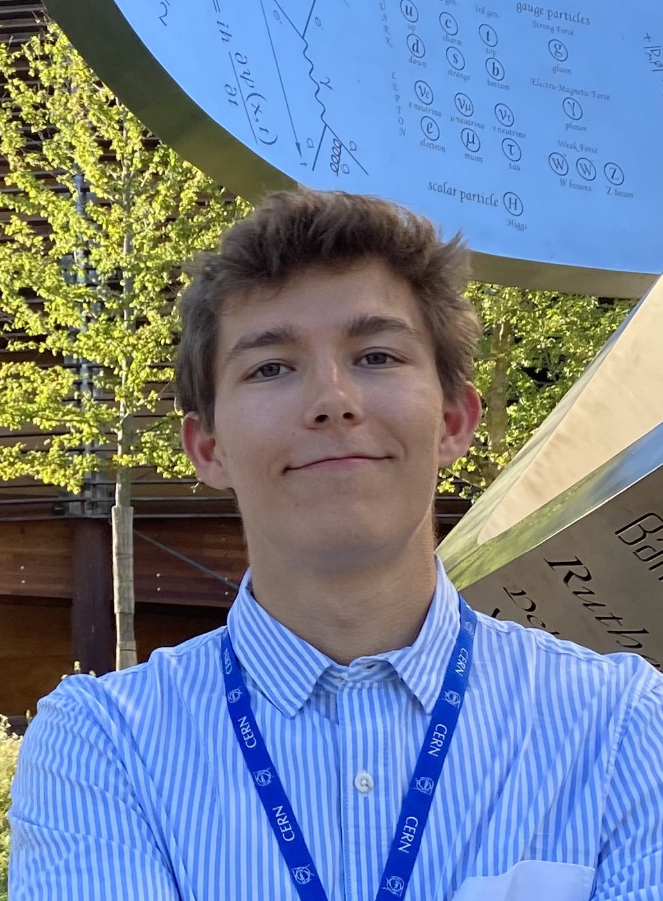

+++
title = "Welcome!"
author = ["Andrés Navarro"]
date = 2024-08-18T00:00:00+02:00
draft = false
+++

I'm currently a **research intern at CERN** and in my **final year** pursuing dual bachelor's degrees in Data Science and Telecommunication Engineering at UC3M.

Since July 2023, I've been diving into the world of distributed and cloud applications as a **research assistant at UC3M**, exploring cutting-edge technologies that shape our digital future.

My primary passion lies in the transformative power of **cloud computing** and its role in driving the next wave of computing advancements. 

Alongside this, I'm deeply engaged with open-source software, DevOps, machine learning, software architecture, and personal growth.

To learn more about me, visit my <a href="https://www.linkedin.com/in/andresnav" target="_blank">LinkedIn</a> profile or check out my <a href="https://raw.githubusercontent.com/andres-nav/andres-nav/main/cv/en/CV.pdf" target="_blank">CV</a>.

    

## About This Site
This site is try to write about my journey, thoughts, project, and what I'm learning since August 2024. I hope you find something interesting here!

The site is divided into a few sections (more will be added over time):
- [Posts](/posts), a selection of my longer-form writing and thoughts
<!-- - [Projects](/projects) - over the years I've built a lot of things -->
<!-- - [Life](/life), where I'm writing about me and my thoughts -->
- [Notes](/notes), where I write about things I'm working on and exploring

## Current & Future Plans
My current focus is on **researching about cloud computing and distributed systems**. 

- How can we leverage the power of the cloud to build scalable, reliable, and efficient systems?
- How will be the future of cloud computing?
- Can we build a more sustainable and efficient cloud for the new hungry AI?

On the future, I'm planning to continue my studies with a master's degree in Cloud Computing and Big Data and continue my research in the field.

## Contact
If you find something interesting here or want to connect, feel free to reach out!

Email: <a href="mailto:contact@andresnav.com" target="_blank">contact@andresnav.com</a> 
LinkedIn: <a href="https://www.linkedin.com/in/andresnav" target="_blank">@andresnav</a> 
GitHub: <a href="https://www.github.com/andres-nav" target="_blank">@andres-nav</a> 
ORCID: <a href="https://orcid.org/0009-0009-8126-6495" target="_blank">0009-0009-8126-6495</a> 
